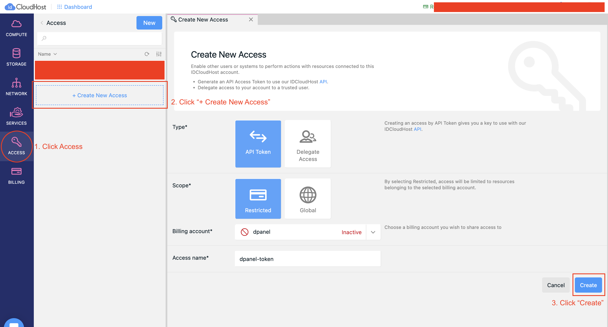
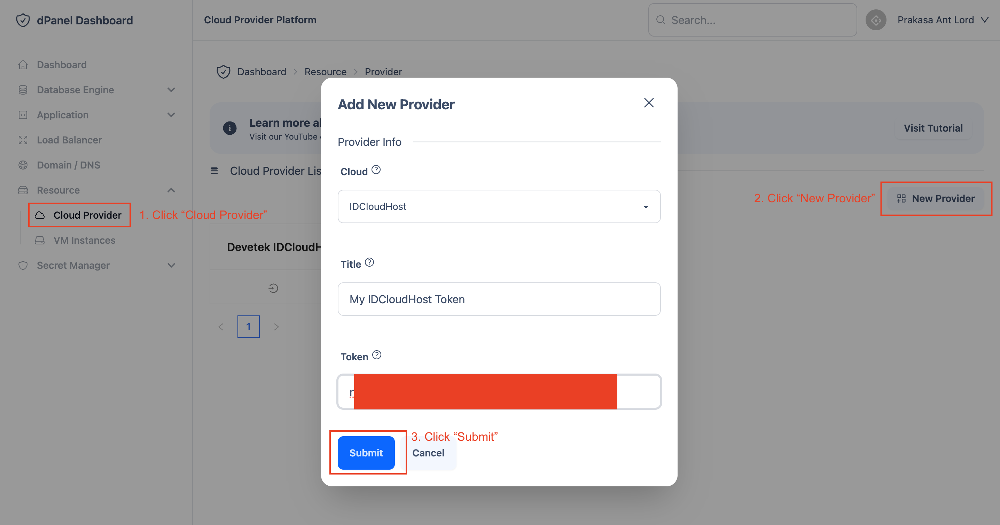
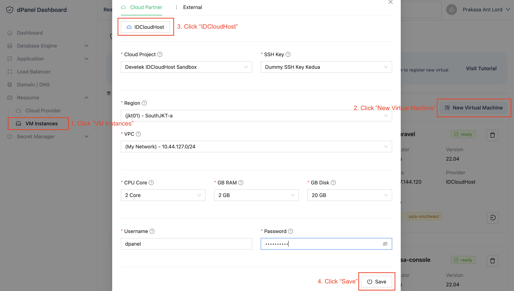

# IDCloudHost

Mendaftarkan mesin dari IDCloudHost menggunakan access token, untuk mempermudah proses pengelolaan IDCloudHost virtual machine dari satu dashboard terintegrasi.

Ikuti langkah berikut ini:

1. Login ke [console IDCloudHost](https://console.idcloudhost.com/hub/login)

2. Masuk ke menu Access, kemudian buat token

3. Salin *Token* di halaman detail token

4. Tambahkan *Cloud Provider* di dPanel

5. Buat SSH Key dari dPanel

5. Buat Virtual Machine dari dPanel
