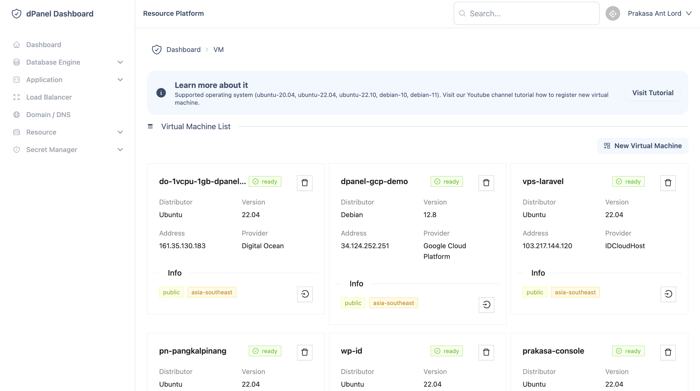

# Penjelasan

## Apa itu dPanel?

dpanel adalah hosting control panel gratis dan modern untuk mengelola banyak server dalam satu dashboard, dengan fokus pada kemudahan tanpa installasi.

Mempermudah proses instalasi berbagai binari untuk kebutuhan aplikasi, lalu jalankan berbagai jenis aplikasi PHP, Node.js, Python, Ruby, Golang di dalam server.

Dukungan peluncuran cepat untuk:

- IDCLoudHost

