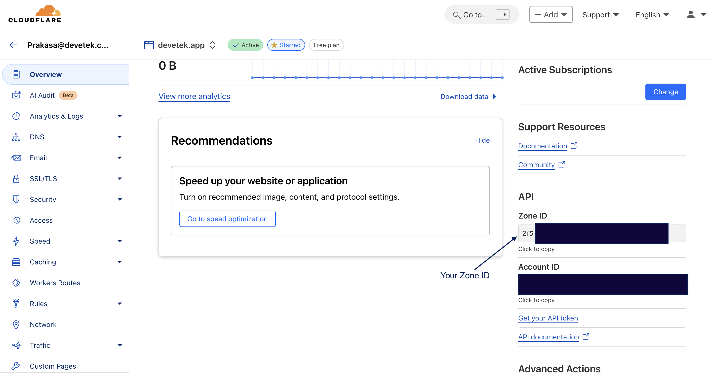
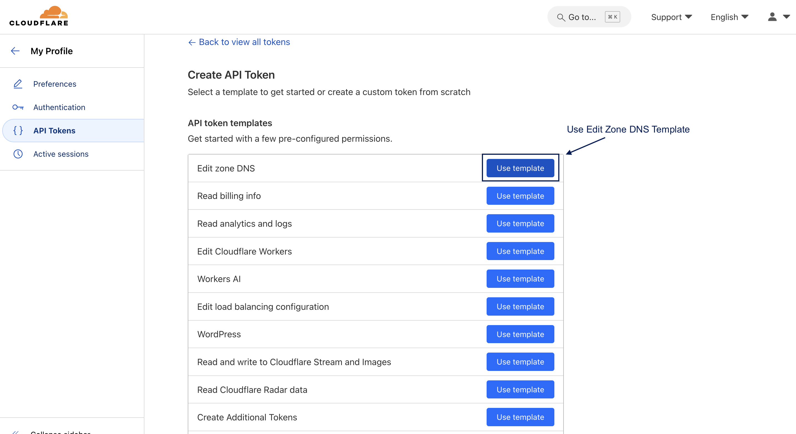
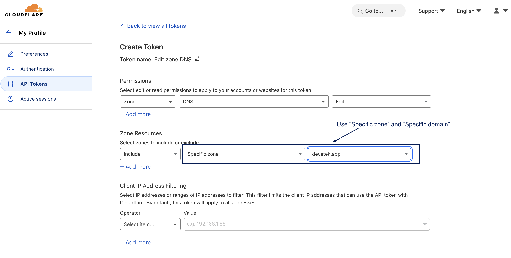
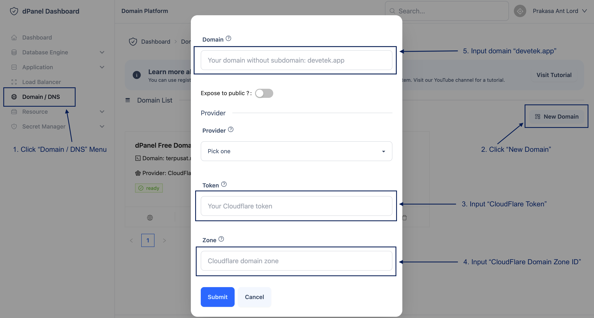

# Tambah Domain

dPanel mendukung fitur pengelolaan domain dari DNS manager terkemuka seperti Cloudflare, AWS Route53, Digital Ocean dan lain-lain untuk mempermudah dalam proses integrasi dengan ekosistem aplikasi. Dengan memindahkan pengelolaan domain ke dPanel, membuat publikasi aplikasi lebih mudah termasuk pembuatan SSL.

Ikuti langkah-langkah berikut untuk memindahkan pengelolaan domain ke dPanel:

## Cloudflare

1. Login ke CloudFlare Dashboard [di sini](https://dash.cloudflare.com/login)

2. Pilih domain di halaman "Website"

3. Salin domain Zone ID

4. Buat CloudFlare Token [di sini](https://dash.cloudflare.com/profile/api-tokens)

5. Gunakan Token Template "Edit Zone DNS"

6. Pilih detail pengaturan token

7. Tambah domain [di sini](https://cloud.terpusat.com/domain)

