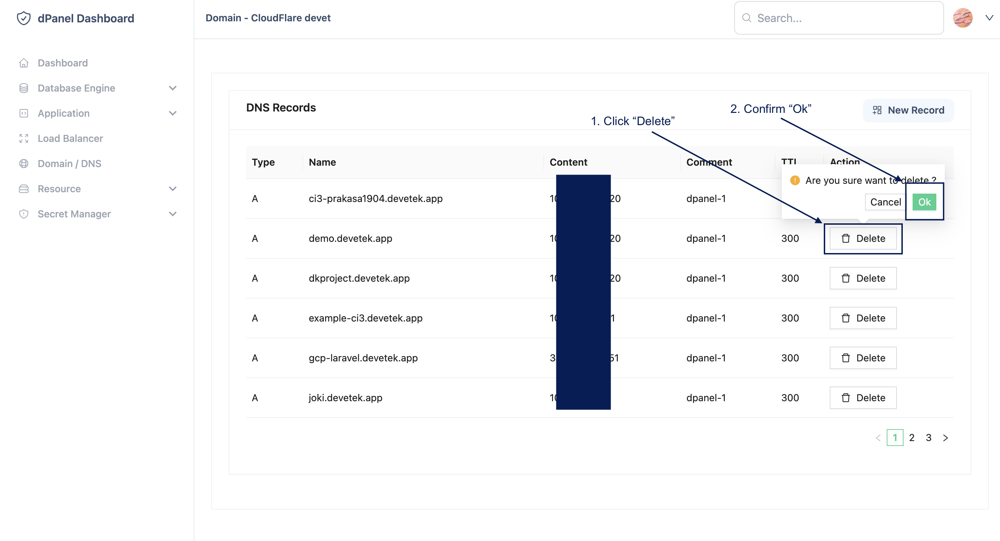

# Kelola Domain

Setelah sukses [tambah domain](/docs/id/platform/dns/add-domain), pengelolaan domain di dPanel akan mempermudah proses integrasi dengan ekosistem aplikasi. Beberapa hal yang dapat dilakukan di platform *Kelola Domain*: 

## Tambah Subdomain

Menambahkan subdomain dengan type A dapat langsung diarahkan ke *sumber daya terkelola* (virtual machine) yang sudah dibuat di dPanel.

## Ubah Subdomain

Coming soon!

## Hapus Subdomain

Untuk mnghapus subdomain yang sudah tidak digunakan, berikut langkah-langkah:

